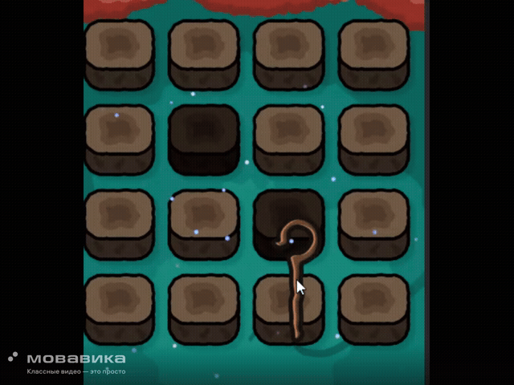
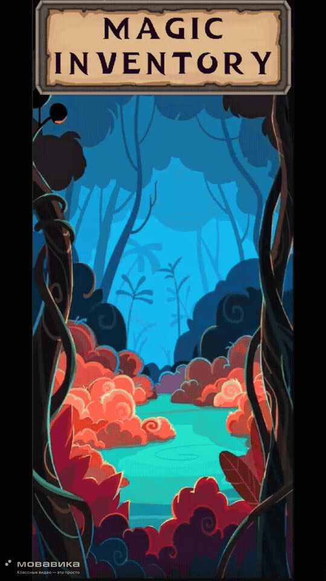
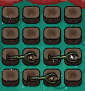
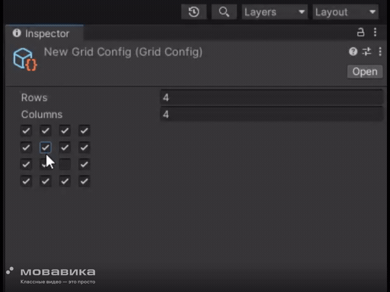

# Реализация инвентаря, вдохновленного Bag Fight

Данный проект является тестовым заданием.

## Задание

Реализовать инвентарь, вдохновленный мобильной игрой Bag Fight.

- В проекте есть поле из клеток — сумка, в которую можно помещать объекты различной формы, находящиеся вне сумки.
- При извлечении объектов из сумки они возвращаются в невидимый слот внизу.
- Важно предусмотреть возможность динамического изменения количества клеток и формы сумки (см. приложенный скриншот).
- Проект ориентирован на комфортное использование на мобильных устройствах.
- Дополнительно допускается добавление анимаций.
- Также можно реализовать механику объединения (мерджа) предметов с одинаковым уровнем и формой внутри сумки. 

## Сборка

[Скачать билд с Google Drive](https://drive.google.com/drive/folders/1ybVXzAiFBO3R3y-Na2VHU1Obwm8bVKdy?usp=sharing)

---

## В игре присутствуют:

### Puzzle механика  
Двигай волшебные жезлы разной формы в доступные ячейки, грамотно управляй пространством, которое имеешь!

  

  
### Красивый стилизованный UI  
Эффекты и анимации для полного погружения

  

### Апргрейд жезлов  
Каждый жезл имеет апгрейд — стакай одинаковые жезлы для их улучшения и освобождай место!

  

---

## Внутри проекта

### Используемые технологии

  
  
  
  
  
  
  

---

### Удобный редактор сетки

Который включается и выключается галочками:

  

  
### Структура проекта

Удобная и простая архетиктура, легко настриваемые конфиги и переиспользуемые префабы для UI

